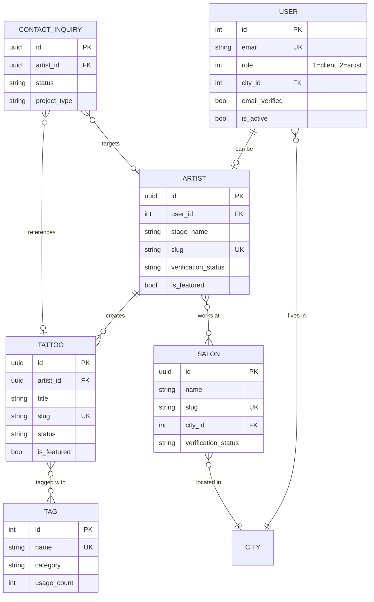

# 01 - Business Rules

## Domain Model Blottr

### Terminologie Métier

| Terme | Définition | Aliases |
|-------|------------|---------|
| **Client** | Utilisateur cherchant un tatoueur | User (role=1) |
| **Tatoueur** | Artiste proposant services de tatouage | Artist, User (role=2) |
| **Salon** | Établissement physique de tatouage | Studio, Shop |
| **Tattoo** | Œuvre de tatouage (portfolio) | Ink, Design, Piece |
| **Tag** | Mot-clé de catégorisation | Keyword, Label |
| **Inquiry** | Demande de contact client→artiste | Contact, Request, Lead |
| **City** | Ville française (référentiel géographique) | Ville, Location |
| **Verification** | Processus de validation artiste/salon | Validation, Approval |

### Objets Métier Core



---

## Règles Métier Formelles

### R1: Gestion des Utilisateurs

**R1.1 - Inscription Utilisateur**
```
IF user submits registration form
THEN
  - VALIDATE email (unique, format valid)
  - VALIDATE password (min 8 chars, per VineJS schema)
  - VALIDATE full_name (not empty)
  - CREATE user with role=1 (client) by default
  - SET email_verified=false
  - SET is_active=true
  - LOGIN user automatically
  - REDIRECT to /connexion with success message
```

**R1.2 - Connexion Utilisateur**
```
IF user submits login form
THEN
  - VALIDATE credentials (email + password)
  - VERIFY user.is_active=true
  - UPDATE last_login_at=now()
  - CREATE session (session-based auth)
  - REDIRECT to homepage
```

**R1.3 - Rôles Utilisateur**
```
User.role MUST be IN (1, 2)
  - 1 = Client (default)
  - 2 = Artiste

IF user.role = 2
THEN user MUST have artist record (one-to-one)

Constraint: CHECK role IN (1, 2)
```

---

### R2: Gestion des Artistes

**R2.1 - Création Profil Artiste**
```
IF user wants to become artist
THEN
  - user.role MUST = 2
  - CREATE artist record with:
    - user_id (unique)
    - stage_name (required)
    - slug (auto-generated, unique)
    - verification_status = 'unverified'
    - city_id (required)
  - OPTIONALLY link to primary_salon_id
```

**R2.2 - Statuts de Vérification**
```
verification_status ENUM:
  - 'unverified': Initial state
  - 'scraped': Data scraped from web
  - 'contacted': Contact attempt made
  - 'onboarding': In verification process
  - 'verified': Fully verified ✓

Transition Flow:
  unverified → scraped → contacted → onboarding → verified

Business Rule:
  IF verification_status = 'verified'
  THEN
    - SET verified_at = now()
    - SET verified_by = admin_id
    - ALLOW is_featured = true (optional)
```

**R2.3 - Association Artiste-Salon**
```
Relationship Types (artist_salons.relationship_type):
  - 'primary': Main salon (only one per artist)
  - 'guest': Guest artist
  - 'freelance': Independent/occasional

Business Rules:
  IF relationship_type = 'primary'
  THEN artist.primary_salon_id = salon.id

  IF artist has multiple salons
  THEN ONLY one can have relationship_type = 'primary'

  IF relationship ends
  THEN SET ended_working_at = now(), is_active = false
```

---

### R3: Gestion des Tattoos (Portfolio)

**R3.1 - Publication Tattoo**
```
Tattoo Status Workflow:
  draft → pending_review → published → archived

IF artist uploads tattoo
THEN
  - CREATE with status='draft'
  - VALIDATE image (max 5MB, formats: jpg|jpeg|png|gif|webp)
  - GENERATE image_variants (thumbnail, medium, large, original)
  - CALCULATE content_hash (SHA256) for duplicate detection
  - EXTRACT dimensions & aspect_ratio
  - SET allows_inquiries=true by default

IF status changes to 'published'
THEN
  - SET published_at = now()
  - INCREMENT artist.total_tattoos
  - UPDATE engagement_score (formula: views + likes*2 + shares*3)
```

**R3.2 - Tagging System**
```
Tag Categories:
  - style: Traditional, Realistic, Watercolor, etc.
  - subject: Animal, Portrait, Geometric, etc.
  - body_part: Arm, Back, Chest, etc.
  - color: Black&Grey, Color, Single Color
  - size: Small, Medium, Large, Full Piece
  - technique: Dotwork, Linework, etc.
  - mood: Dark, Minimal, Colorful, etc.
  - cultural: Japanese, Polynesian, Celtic, etc.

Business Rules:
  IF tag.category = 'style'
  THEN tag SHOULD be is_primary=true (one per tattoo)

  IF tag is auto-assigned (AI)
  THEN assignment_type='ai_suggested', requires_approval=true

  IF tag.usage_count > threshold
  THEN tag.is_trending=true, popularity_score increases
```

---

### R4: Système de Contact (Inquiries)

**R4.1 - Création Contact Inquiry**
```
IF client submits contact form
THEN
  - VALIDATE required fields: fullName, email, subject, message, projectType
  - VERIFY artist_id exists (if provided)
  - UPLOAD reference_images (max 5MB each, max 5 files)
  - GENERATE inquiry with:
    - status = 'pending'
    - source = 'website' | 'quick_form'
    - priority = 3 (default, range 1-10)
    - ip_address = request.ip()
    - user_agent = request.headers
  - SEND notification to artist (email/webhook)
  - RETURN success + inquiryId
```

**R4.2 - Statuts Inquiry**
```
Status Flow:
  pending → in_progress → replied → closed
            ↓
          spam (if flagged)

Business Rules:
  IF status = 'spam'
  THEN BLOCK sender.ip_address (rate limiting)

  IF first reply sent
  THEN SET first_replied_at = now(), INCREMENT replies_count

  IF artist reads inquiry
  THEN SET is_read = true

  Priority Rules:
    1-3: Low priority (> 48h response time)
    4-7: Medium priority (< 24h response time)
    8-10: High priority (< 4h response time)
```

**R4.3 - Types de Projets**
```
project_type ENUM:
  - 'consultation': Initial consultation request
  - 'quote': Price estimate request
  - 'appointment': Direct booking attempt
  - 'question': General inquiry

Routing Logic:
  IF project_type = 'appointment' AND artist.appointment_only = false
  THEN suggest alternative contact methods

  IF project_type = 'quote'
  THEN REQUEST: size, placement, style, budget (required fields)
```

---

### R5: Système de Recherche & Découverte

**R5.1 - Filtrage Artistes**
```
Available Filters:
  - city_id: Geographic filter
  - art_styles[]: Array of styles (OR logic)
  - verification_status: Only verified/all
  - is_accepting_new_clients: Boolean
  - price_range: min_price-max_price
  - experience_level: ENUM

Search Logic:
  IF no filters applied
  THEN ORDER BY: is_featured DESC, priority DESC, created_at DESC

  IF city filter applied
  THEN calculate distance (lat/lng) for proximity sort

  IF style filter applied
  THEN match artists.art_styles JSONB contains any
```

**R5.2 - Full-Text Search**
```
PostgreSQL FTS configured on:
  - tattoos.title + tattoos.description (GIN index)
  - artists.stage_name + artists.bio
  - salons.name + salons.description

Search Query:
  to_tsvector('english', title || ' ' || COALESCE(description, ''))

Ranking:
  - Exact match in title: weight=1.0
  - Partial match in title: weight=0.7
  - Match in description: weight=0.3
  - Match in tags: weight=0.5
```

---

### R6: Système de Vérification (Quality Gates)

**R6.1 - Vérification Artiste**
```
Verification Checklist:
  □ Professional credentials uploaded
  □ Health certificate valid (has_health_certificate=true)
  □ Professional insurance active (has_professional_insurance=true)
  □ Portfolio minimum (>= 5 tattoos published)
  □ Contact information verified (email + phone)
  □ Salon association confirmed

IF all checks pass
THEN
  - SET verification_status = 'verified'
  - SET verified_at = now()
  - SET verified_by = admin.id
  - STORE verification_notes (audit trail)
  - NOTIFY artist (email/notification)
```

**R6.2 - Vérification Salon**
```
Salon Verification:
  □ Physical address verified (geocoded)
  □ Business registration confirmed
  □ Opening hours provided
  □ Contact methods validated (phone/email)
  □ At least 1 verified artist associated

Status Progression:
  scraped → contacted → onboarding → verified
```

---

### R7: KPIs & Metrics Métier

**R7.1 - Artist Performance KPIs**
```
Calculated Fields:
  - average_rating: AVG(reviews.rating)
  - total_reviews: COUNT(reviews)
  - total_tattoos: COUNT(tattoos WHERE status='published')
  - profile_views: Incremented on view
  - engagement_score: (views + likes*2 + shares*3) / days_since_created

Thresholds:
  - Featured Artist: engagement_score > 100 AND total_tattoos >= 10
  - Top Artist: average_rating >= 4.5 AND total_reviews >= 20
```

**R7.2 - Platform KPIs**
```
Business Metrics:
  - Total verified artists
  - Total active salons
  - Total published tattoos
  - Contact inquiry conversion rate (replied / total)
  - Average response time (first_replied_at - created_at)
  - Geographic coverage (cities with >= 1 artist)
```

---

## États & Transitions Clés

### État Utilisateur
```
[Anonyme]
  → [Inscrit] (email not verified)
    → [Actif] (email verified, is_active=true)
      → [Inactif] (is_active=false)
      → [Artiste] (role=2, has artist profile)
```

### État Artiste
```
[Non vérifié]
  → [Scrappé] (data collected from web)
    → [Contacté] (verification email sent)
      → [En vérification] (documents submitted)
        → [Vérifié] (all checks passed)
          → [Featured] (optional, high quality)
```

### État Tattoo
```
[Brouillon]
  → [En révision]
    → [Publié] (visible to public)
      → [Archivé] (removed from public view)
```

### État Contact Inquiry
```
[Pending]
  → [In Progress] (artist acknowledged)
    → [Replied] (artist responded)
      → [Closed] (inquiry resolved)

[Pending] → [Spam] (flagged by system/admin)
```

---

## Validation Rules (VineJS Schemas)

### RegisterValidator
```typescript
email: Required, Email format, Unique in users table
password: Required, Min 8 characters
fullName: Required, String
```

### LoginValidator
```typescript
email: Required, Email format
password: Required
```

### ContactInquiryValidator
```typescript
fullName: Required, Max 100 chars
email: Required, Email format
phone: Optional, Max 50 chars
subject: Required, Max 200 chars
message: Required, Text
projectType: Required, Enum(consultation|quote|appointment|question)
artistId: Optional, UUID, Exists in artists
tattooId: Optional, UUID, Exists in tattoos
budget: Optional, String
preferredDate: Optional, String
location: Optional, String
size: Optional, String
placement: Optional, String
tattooStyles: Optional, JSON Array
referenceImages: Optional, Files (max 5MB, max 5 files)
```

---

## Flows Critiques

### Flow 1: Client Search → Contact Artist
```
1. Client lands on homepage
2. Filters by city + style
3. Views artist profile
4. Opens contact modal
5. Fills inquiry form (+ uploads references)
6. Submits inquiry
7. System:
   - Validates form
   - Uploads files to storage
   - Creates inquiry record
   - Sends email to artist
   - Returns success confirmation
8. Client sees success message with inquiry ID
```

### Flow 2: Artist Onboarding
```
1. User registers (role=1, client)
2. User navigates to "Devenir artiste"
3. Fills artist profile form
4. System:
   - Updates user.role = 2
   - Creates artist record
   - Sets verification_status='unverified'
5. Admin reviews application
6. Admin requests documents
7. Artist uploads:
   - Health certificate
   - Insurance proof
   - Portfolio (min 5 tattoos)
8. Admin verifies all documents
9. System sets verification_status='verified'
10. Artist receives verification email
11. Artist profile becomes public
```

### Flow 3: Tattoo Publication
```
1. Artist uploads tattoo image
2. System:
   - Validates file (size, format)
   - Generates variants (thumb, medium, large)
   - Calculates hash for duplicate detection
   - Extracts EXIF metadata
   - Creates tattoo record (status='draft')
3. Artist adds metadata:
   - Title, description
   - Style, placement, size
   - Tags (manual + AI suggestions)
4. Artist publishes
5. System:
   - Sets status='published'
   - Sets published_at=now()
   - Increments artist.total_tattoos
   - Indexes for full-text search
6. Tattoo appears in public gallery
```

---

## Business Constraints & Invariants

### Hard Constraints (Database Level)
```sql
-- User role must be 1 or 2
CHECK (users.role IN (1, 2))

-- Geographic coordinates valid
CHECK (cities.latitude >= -90 AND latitude <= 90)
CHECK (cities.longitude >= -180 AND longitude <= 180)

-- Priority range
CHECK (contact_inquiries.priority BETWEEN 1 AND 10)

-- One-to-one user-artist
UNIQUE (artists.user_id)

-- Unique slugs
UNIQUE (artists.slug)
UNIQUE (salons.slug)
UNIQUE (tattoos.slug)
UNIQUE (cities.slug)
UNIQUE (tags.slug)
```

### Soft Constraints (Application Level)
```
- Artist must have >= 5 published tattoos to be featured
- Salon must have >= 1 verified artist to be verified
- Contact inquiry older than 30 days auto-closes
- Tattoo without views in 90 days auto-archives
- Tag with usage_count=0 for 180 days is soft-deleted
```

---

## Edge Cases & Exceptions

### EC1: Duplicate Tattoo Detection
```
IF tattoo.content_hash matches existing
THEN
  - WARN artist: "Similar image already uploaded"
  - ALLOW upload if artist confirms (different angle/context)
  - LOG for admin review
```

### EC2: Artist Works in Multiple Cities
```
IF artist has multiple salons in different cities
THEN
  - artist.city_id = primary_salon.city_id
  - Display all salon locations on profile
  - Allow filtering by any associated city
```

### EC3: Inquiry Without Artist
```
IF inquiry.artist_id IS NULL
THEN
  - Route to platform admin inbox
  - Admin manually assigns to suitable artist
  - OR: Auto-suggest artists based on style+location
```

### EC4: Inactive User with Artist Profile
```
IF user.is_active = false AND user.role = 2
THEN
  - Hide artist profile from public search
  - Preserve data for potential reactivation
  - Auto-respond to inquiries: "Artist currently unavailable"
```

---

**Version:** 1.0.0
**Last Updated:** 2025-10-05
