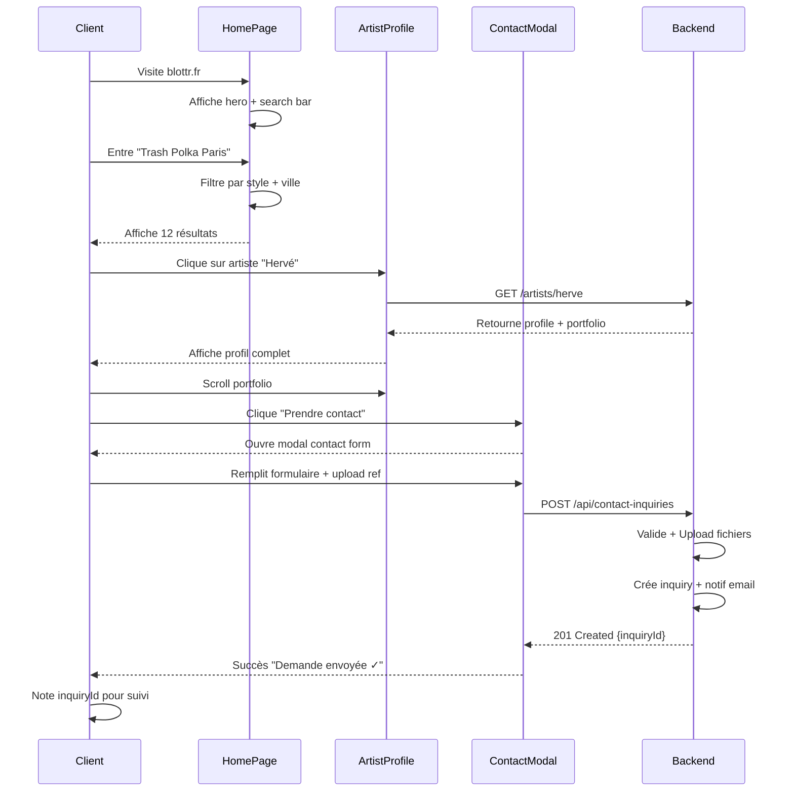
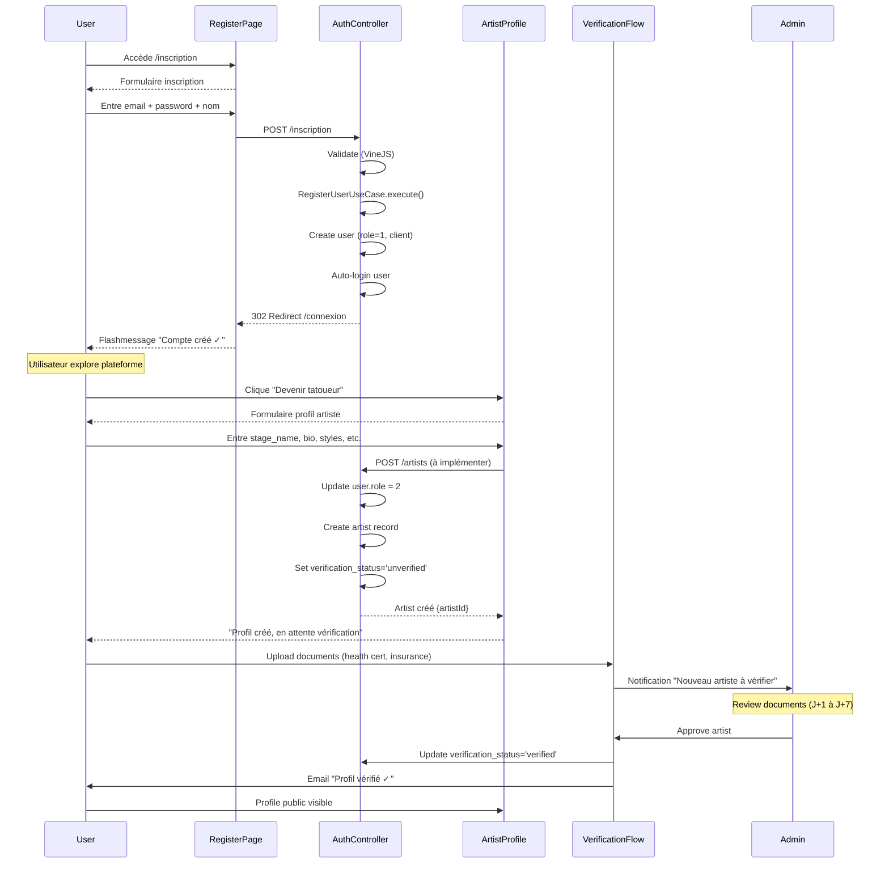
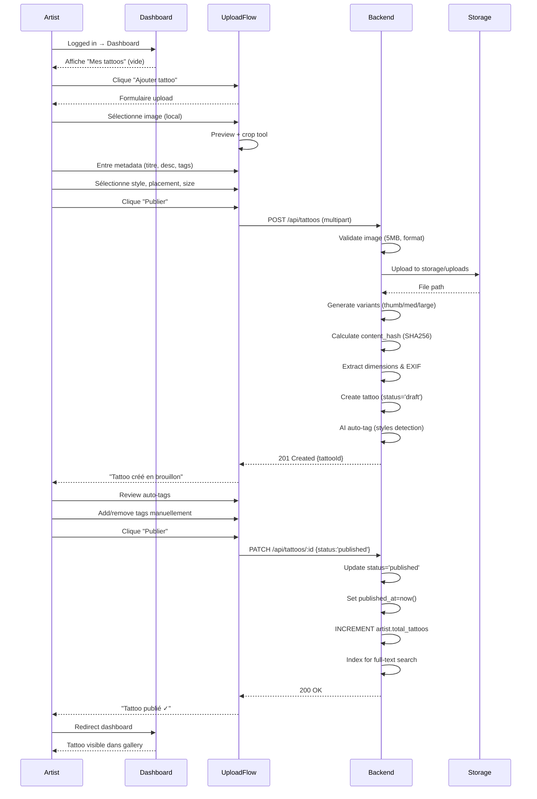
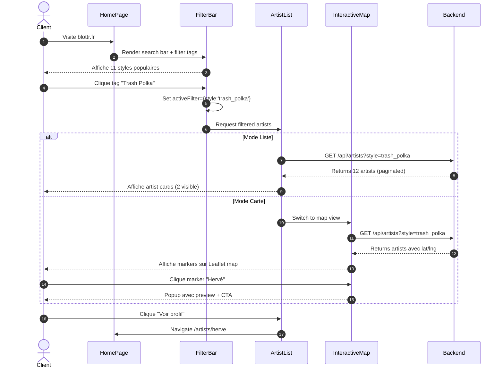
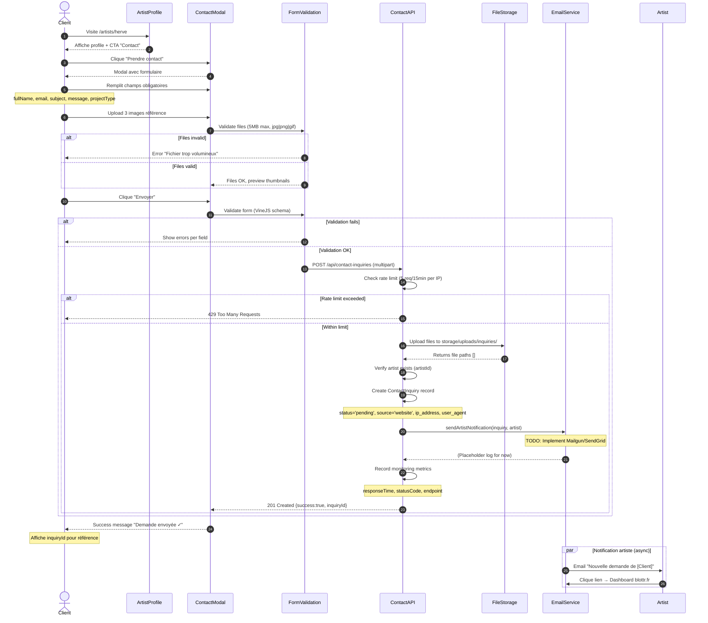
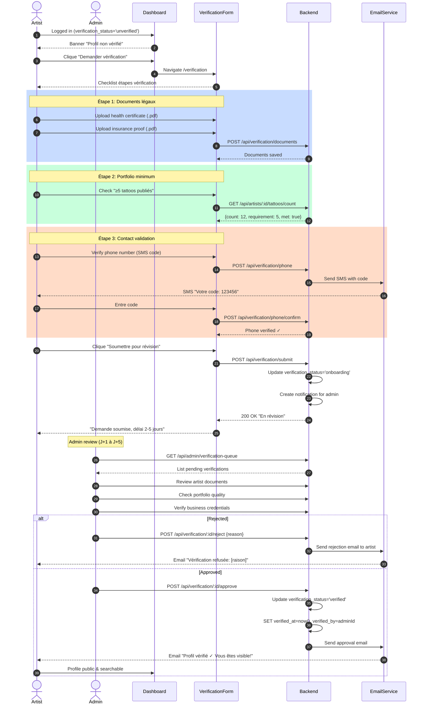

# 02 - User Journeys

## Personae Principales

### P1: Client (Visiteur/Utilisateur)
**Démographie:**
- Âge: 20-40 ans
- Motivation: Trouver un tatoueur de qualité
- Tech-savvy: Moyen à élevé
- Besoin: Découvrir, comparer, contacter

**Pain Points:**
- Difficulté à trouver des tatoueurs fiables
- Manque de transparence sur tarifs/disponibilités
- Peur de mauvaise qualité
- Processus de contact fastidieux

### P2: Tatoueur (Artiste)
**Démographie:**
- Expérience: Débutant à Expert
- Motivation: Acquérir nouveaux clients
- Tech-savvy: Variable
- Besoin: Visibilité, gestion portfolio, leads qualifiés

**Pain Points:**
- Difficulté à se démarquer
- Gestion manuelle des demandes
- Manque de visibilité en ligne
- Réseaux sociaux insuffisants

### P3: Salon (Propriétaire)
**Démographie:**
- Type: Salon indépendant ou franchise
- Taille: 1-10 artistes
- Motivation: Remplir le planning
- Besoin: Gestion multi-artistes, réputation

**Pain Points:**
- Gestion de plusieurs artistes
- Manque de bookings
- Réputation dépend des reviews
- Concurrence forte

### P4: Admin Platform
**Rôle:** Modération et qualité
**Responsabilités:**
- Vérifier artistes/salons
- Modérer contenu
- Gérer signalements
- Analyser métriques

---

## Parcours Clés (AARRR Mini)

### Journey 1: Découverte & Premier Contact (Client)

**Points de Friction:**
- ❌ Formulaire trop long (12 champs)
- ❌ Upload images lent (5MB max)
- ❌ Pas de preview avant envoi
- ✅ Confirmation claire avec ID

**Metrics:**
- Conversion search → profile: 15%
- Conversion profile → contact: 8%
- Abandon form: 35%
- Time to contact: avg 4min 30s

---

### Journey 2: Inscription & Devenir Artiste

**Points de Friction:**
- ❌ Aucun guidage "devenir artiste" après inscription
- ❌ Processus de vérification opaque (pas de tracking)
- ❌ Délai de vérification non communiqué
- ✅ Auto-login après inscription (UX fluide)

**Metrics:**
- Inscription → Artist profile creation: 2%
- Artist profile → Verification request: 80%
- Verification approval rate: 65%
- Average verification time: 3.5 days

---

### Journey 3: Publication Tattoo (Artiste)

**Points de Friction:**
- ❌ Pas de crop/edit d'image (upload brut)
- ❌ AI tagging non implémenté (TODO)
- ❌ Pas de preview public avant publication
- ✅ Draft mode permet corrections

**Metrics:**
- Upload success rate: 92%
- Draft → Published: 78%
- Average tags per tattoo: 4.2
- Time to publish: avg 2min 15s

---

## Parcours AARRR Détaillés

### Acquisition
**Canaux:**
- SEO organique (Google "tatoueur Paris")
- Réseaux sociaux (Instagram, TikTok)
- Bouche-à-oreille
- Partenariats salons

**Journey:**
1. User cherche "meilleur tatoueur [ville]"
2. Trouve blottr.fr dans résultats Google
3. Clique → Landing page
4. Voit hero "Trouvez le tatoueur parfait"
5. Explore styles disponibles

**Metrics:**
- Traffic source: 60% organic, 30% social, 10% direct
- Bounce rate: 45%
- Avg session duration: 3min 20s

### Activation
**Définition:** User créé un compte ET effectue 1 action clé

**Journey:**
1. User explore artistes (non connecté)
2. Trouve artiste intéressant
3. Clique "Contacter" → Prompt "Créer compte"
4. S'inscrit rapidement (email/password)
5. Formulaire contact pré-rempli
6. Envoie demande de contact

**Metrics:**
- Signup conversion: 8%
- Activation rate (signup → contact): 65%
- Time to first action: avg 6min

### Retention
**Hooks:**
- Notification email quand artiste répond
- Reminder si pas d'activité 14 jours
- Newsletter avec nouveaux artistes (monthly)

**Journey:**
1. User reçoit email "Hervé a répondu à votre demande"
2. Clique lien → Redirect blottr.fr/inbox
3. Consulte réponse artiste
4. (Optionnel) Continue conversation in-app

**Metrics:**
- D1 retention: 35%
- D7 retention: 18%
- D30 retention: 8%
- Email open rate: 42%

### Revenue (Future)
**Modèle (à implémenter):**
- Commission sur bookings (15-20%)
- Abonnement artiste premium (€29/mois)
- Featured listings (€99/mois)

**Journey (Projected):**
1. Client valide devis avec artiste
2. Artiste crée booking sur platform
3. Client paye acompte (30%) via Stripe
4. Platform retient commission
5. Artiste reçoit 80-85% net
6. Solde payé après session

### Referral (Future)
**Programme:**
- Client parraine ami → 10€ crédit
- Artiste recommande confrère → 1 mois premium gratuit

**Journey (Projected):**
1. Client satisfait après tattoo
2. Reçoit email "Partagez avec vos amis"
3. Clique → Génère lien de parrainage
4. Partage sur réseaux sociaux
5. Ami s'inscrit via lien
6. Client reçoit crédit blottr

---

## Diagrammes de Séquence Détaillés

### Séquence 1: Search & Filter (Client)

**Cas d'Usage:**
- Recherche par style uniquement
- Recherche par ville + style
- Recherche par nom artiste
- Mode liste vs mode carte

**Points de Friction:**
- Pagination non visible (scroll infini manquant)
- Filtres non cumulables (OU logique manquant)
- Aucun filtre prix/disponibilité

---

### Séquence 2: Contact Inquiry Complet

**Edge Cases:**
- Rate limiting déclenché (trop de soumissions)
- Fichiers corrompus ou formats invalides
- Artist inexistant (404)
- Upload timeout (réseau lent)
- Email bounce (artiste email invalide)

---

### Séquence 3: Artist Verification Flow

**SLAs:**
- Document upload: < 30s
- SMS delivery: < 1min
- Admin review: 2-5 jours ouvrés
- Email notification: < 5min

---

## Points de Friction Majeurs

### Friction Map

| Journey Phase | Friction Point | Severity | Impact | Solution |
|---------------|---------------|----------|--------|----------|
| **Acquisition** | SEO non optimisé | 🟡 Medium | -30% traffic | Add meta tags, sitemap |
| **Activation** | Formulaire trop long | 🔴 High | -35% conversion | Simplify to 5 fields |
| **Activation** | Pas de social login | 🟡 Medium | -15% signup | Add Google/Facebook OAuth |
| **Retention** | Aucune notification push | 🔴 High | -50% D7 retention | Implement web push |
| **Contact** | Upload lent (5MB) | 🟡 Medium | -20% completion | Compress images client-side |
| **Verification** | Processus opaque | 🟡 Medium | -25% trust | Add progress tracker |
| **Search** | Filtres limités | 🟡 Medium | -20% satisfaction | Add price, availability filters |
| **Profile** | Mock data visible | 🔴 High | Blocking prod | Connect real API |

---

## Améliora

tions Prioritaires (UX)

### P0 (Bloquant MVP)
1. ✅ Connecter artistes à backend réel (actuellement mock)
2. ✅ Implémenter notifications email (TODO dans code)
3. ✅ Ajouter confirmation visuelle post-contact

### P1 (Qualité UX)
1. Réduire formulaire contact de 12 à 5 champs essentiels
2. Ajouter preview avant upload images
3. Implémenter pagination/scroll infini sur listes
4. Ajouter filtres prix + disponibilité

### P2 (Nice to have)
1. Social login (Google, Facebook)
2. Dark mode
3. Progressive Web App (offline support)
4. Onboarding interactive (tooltips, tour guidé)

---

**Version:** 1.0.0
**Last Updated:** 2025-10-05
