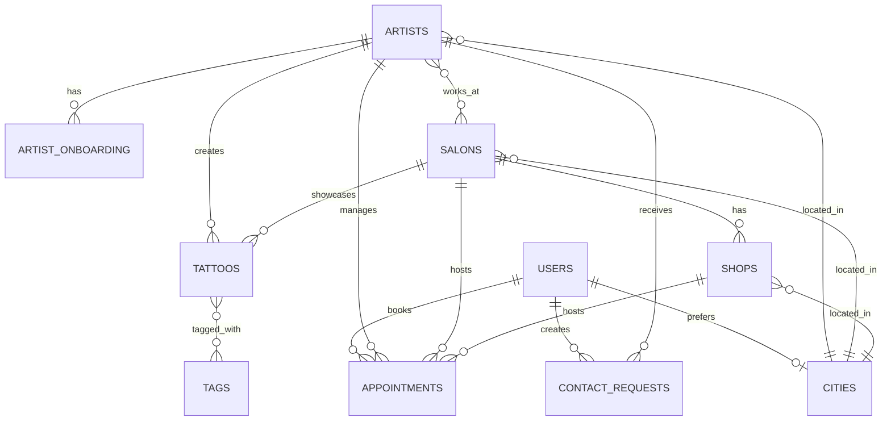
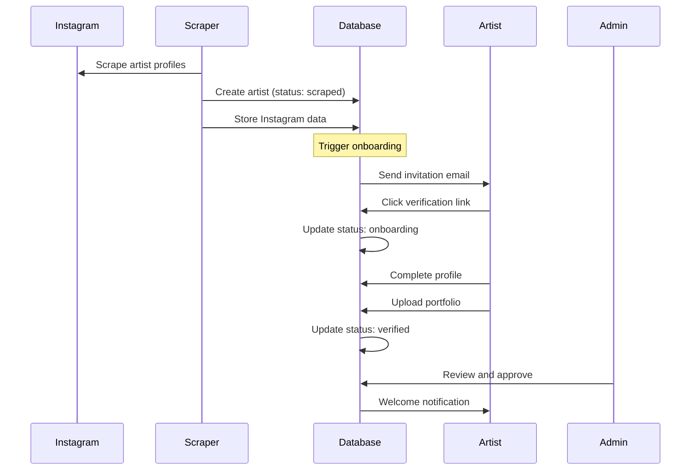
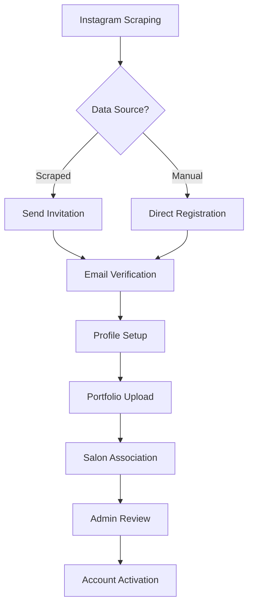

# 📊 Blottr Database Documentation

## Table of Contents

1. [Overview](#overview)
2. [Architecture](#architecture)
3. [Core Tables](#core-tables)
4. [Relationship Tables](#relationship-tables)
5. [Business Logic](#business-logic)
6. [Data Flow](#data-flow)
7. [Security & Privacy](#security--privacy)
8. [Performance Optimization](#performance-optimization)
9. [Migration Guide](#migration-guide)

---

## Overview

The Blottr database is designed to support a comprehensive tattoo artist discovery and booking platform with Instagram integration, multi-salon support, and automated onboarding workflows.

### Key Features

- **UUID Primary Keys**: All tables use UUIDs for globally unique identifiers
- **Multi-tenant Architecture**: Support for multiple salons and independent artists
- **Instagram Integration**: Automated scraping and verification workflows
- **Geographic Search**: City-based search with GPS coordinates
- **SEO Optimization**: Slug generation and meta descriptions
- **Analytics Ready**: View counts, favorites, and engagement metrics

### Technology Stack

- **Database**: PostgreSQL 16
- **ORM**: AdonisJS Lucid
- **Migrations**: AdonisJS Schema Builder
- **Visualization**: pgAdmin 4

---

## Architecture

### Database Design Principles

1. **Normalization**: 3NF (Third Normal Form) to minimize redundancy
2. **Scalability**: Designed for horizontal scaling with UUID keys
3. **Flexibility**: JSONB fields for dynamic data structures
4. **Performance**: Strategic indexing on search and join columns
5. **Integrity**: Foreign key constraints with appropriate cascade rules

### Entity Relationship Overview



---

## Core Tables

### 1. USERS Table

**Purpose**: Store all platform users (clients and artists)

| Column                     | Type         | Description           | Constraints         |
| -------------------------- | ------------ | --------------------- | ------------------- |
| `id`                       | UUID         | Primary key           | PK, auto-generated  |
| `email`                    | VARCHAR(255) | User email            | UNIQUE, NOT NULL    |
| `password`                 | VARCHAR(255) | Hashed password       | NOT NULL            |
| `role`                     | INTEGER      | 1=client, 2=artist    | NOT NULL, DEFAULT 1 |
| `phone`                    | VARCHAR(255) | Contact number        | NULLABLE            |
| `birth_date`               | DATE         | User birthdate        | NULLABLE            |
| `gender`                   | VARCHAR(255) | User gender           | NULLABLE            |
| `preferred_city_id`        | UUID         | Preferred location    | FK → cities.id      |
| `last_login_at`            | TIMESTAMP    | Last login time       | NULLABLE            |
| `last_activity_at`         | TIMESTAMP    | Last activity         | NULLABLE            |
| `avatar_file`              | VARCHAR(255) | Profile picture       | NULLABLE            |
| `tattoo_view_count`        | INTEGER      | Tattoos viewed        | DEFAULT 0           |
| `artist_contact_count`     | INTEGER      | Artists contacted     | DEFAULT 0           |
| `style_preferences`        | JSON         | Preferred styles      | NULLABLE            |
| `notification_preferences` | JSON         | Notification settings | NULLABLE            |
| `created_at`               | TIMESTAMP    | Creation date         | AUTO                |
| `updated_at`               | TIMESTAMP    | Last update           | AUTO                |

**Indexes**:

- Primary: `id`
- Unique: `email`
- Foreign: `preferred_city_id`

**Relationships**:

- Has many: `contact_requests`, `appointments`, `auth_access_tokens`
- Belongs to: `cities` (optional)

---

### 2. ARTISTS Table

**Purpose**: Extended profile for tattoo artists with Instagram integration

| Column                | Type         | Description                                      | Constraints              |
| --------------------- | ------------ | ------------------------------------------------ | ------------------------ |
| `id`                  | UUID         | Primary key                                      | PK, auto-generated       |
| `firstname`           | VARCHAR(255) | Artist first name                                | NOT NULL                 |
| `lastname`            | VARCHAR(255) | Artist last name                                 | NOT NULL                 |
| `email`               | VARCHAR(255) | Contact email                                    | NULLABLE                 |
| `phone`               | VARCHAR(255) | Contact phone                                    | NULLABLE                 |
| `bio`                 | TEXT         | Artist biography                                 | NULLABLE                 |
| `avatar`              | VARCHAR(255) | Profile picture                                  | NULLABLE                 |
| `slug`                | VARCHAR(255) | SEO-friendly URL                                 | UNIQUE, NULLABLE         |
| `seo_title`           | VARCHAR(255) | SEO title                                        | NULLABLE                 |
| `seo_description`     | TEXT         | SEO description                                  | NULLABLE                 |
| **Instagram Fields**  |
| `instagram_handle`    | VARCHAR(255) | Instagram username                               | NULLABLE                 |
| `instagram_url`       | VARCHAR(255) | Instagram profile URL                            | NULLABLE                 |
| `instagram_followers` | INTEGER      | Follower count                                   | NULLABLE                 |
| `last_scraped_at`     | TIMESTAMP    | Last scrape date                                 | NULLABLE                 |
| `data_source`         | ENUM         | 'instagram_scraping', 'manual_registration'      | NOT NULL                 |
| **Verification**      |
| `is_verified`         | BOOLEAN      | Verification status                              | DEFAULT FALSE            |
| `is_claimed`          | BOOLEAN      | Profile claimed                                  | DEFAULT FALSE            |
| `verification_status` | ENUM         | 'scraped', 'contacted', 'onboarding', 'verified' | NOT NULL                 |
| `verification_token`  | VARCHAR(255) | Verification token                               | NULLABLE                 |
| `verified_at`         | TIMESTAMP    | Verification date                                | NULLABLE                 |
| **Business Logic**    |
| `is_guest`            | BOOLEAN      | Guest artist                                     | DEFAULT FALSE            |
| `editor_pick`         | BOOLEAN      | Featured artist                                  | DEFAULT FALSE            |
| `salon_id`            | UUID         | Primary salon                                    | FK → salons.id, NULLABLE |
| `city_id`             | UUID         | Location                                         | FK → cities.id, NULLABLE |
| **Analytics**         |
| `view_count`          | INTEGER      | Profile views                                    | DEFAULT 0                |
| `favorite_count`      | INTEGER      | Times favorited                                  | DEFAULT 0                |
| `contact_count`       | INTEGER      | Contact requests                                 | DEFAULT 0                |
| **GPT Analysis**      |
| `gpt_bio`             | TEXT         | AI-generated bio                                 | NULLABLE                 |
| `gpt_styles`          | JSON         | AI-detected styles                               | NULLABLE                 |
| `gpt_analyzed`        | BOOLEAN      | Analysis status                                  | DEFAULT FALSE            |
| `gpt_analyzed_at`     | TIMESTAMP    | Analysis date                                    | NULLABLE                 |

**Indexes**:

- Primary: `id`
- Unique: `slug`, `instagram_handle`
- Foreign: `salon_id`, `city_id`
- Search: `firstname`, `lastname`, `verification_status`

**Relationships**:

- Has many: `tattoos`, `appointments`, `contact_requests`, `artist_onboarding`
- Belongs to: `salon` (optional), `city` (optional)
- Many to many: `salons` (through artist_salon)

---

### 3. SALONS Table

**Purpose**: Tattoo salon/studio information

| Column            | Type         | Description        | Constraints              |
| ----------------- | ------------ | ------------------ | ------------------------ |
| `id`              | UUID         | Primary key        | PK, auto-generated       |
| `name`            | VARCHAR(255) | Salon name         | NOT NULL                 |
| `slug`            | VARCHAR(255) | SEO-friendly URL   | UNIQUE, NULLABLE         |
| `email`           | VARCHAR(255) | Contact email      | NULLABLE                 |
| `phone`           | VARCHAR(255) | Contact phone      | NULLABLE                 |
| `street`          | VARCHAR(255) | Street address     | NULLABLE                 |
| `city`            | VARCHAR(255) | City name          | NULLABLE                 |
| `zip`             | VARCHAR(255) | Postal code        | NULLABLE                 |
| `country`         | VARCHAR(255) | Country code       | NULLABLE                 |
| `city_id`         | UUID         | City reference     | FK → cities.id, NULLABLE |
| `description`     | TEXT         | Salon description  | NULLABLE                 |
| `lgbtq_friendly`  | BOOLEAN      | LGBTQ+ friendly    | DEFAULT FALSE            |
| `logo`            | VARCHAR(255) | Salon logo         | NULLABLE                 |
| `is_private`      | BOOLEAN      | Private salon      | DEFAULT FALSE            |
| `is_verified`     | BOOLEAN      | Verified status    | DEFAULT FALSE            |
| `editor_pick`     | BOOLEAN      | Featured salon     | DEFAULT FALSE            |
| `website`         | VARCHAR(255) | Website URL        | NULLABLE                 |
| `social_links`    | JSON         | Social media links | NULLABLE                 |
| `seo_title`       | VARCHAR(255) | SEO title          | NULLABLE                 |
| `seo_description` | TEXT         | SEO description    | NULLABLE                 |
| `view_count`      | INTEGER      | Profile views      | DEFAULT 0                |
| `contact_count`   | INTEGER      | Contact requests   | DEFAULT 0                |

**Indexes**:

- Primary: `id`
- Unique: `slug`
- Foreign: `city_id`
- Search: `name`, `city`, `zip`

**Relationships**:

- Has many: `artists`, `tattoos`, `appointments`, `shops`
- Belongs to: `city` (optional)
- Many to many: `artists` (through artist_salon)

---

### 4. SHOPS Table

**Purpose**: Physical shop locations for multi-location salons

| Column                       | Type         | Description      | Constraints              |
| ---------------------------- | ------------ | ---------------- | ------------------------ |
| `id`                         | UUID         | Primary key      | PK, auto-generated       |
| `name`                       | VARCHAR(255) | Shop name        | NOT NULL                 |
| `slug`                       | VARCHAR(255) | SEO-friendly URL | UNIQUE, NULLABLE         |
| `salon_id`                   | UUID         | Parent salon     | FK → salons.id, NULLABLE |
| `contact_email`              | VARCHAR(255) | Contact email    | NULLABLE                 |
| `phone`                      | VARCHAR(255) | Contact phone    | NULLABLE                 |
| `street`                     | VARCHAR(255) | Street address   | NULLABLE                 |
| `city`                       | VARCHAR(255) | City name        | NULLABLE                 |
| `city_id`                    | UUID         | City reference   | FK → cities.id, NULLABLE |
| `zip`                        | VARCHAR(255) | Postal code      | NULLABLE                 |
| `country`                    | VARCHAR(255) | Country code     | NULLABLE                 |
| `description`                | TEXT         | Shop description | NULLABLE                 |
| `lgbtq_friendly`             | BOOLEAN      | LGBTQ+ friendly  | DEFAULT FALSE            |
| `logo`                       | VARCHAR(255) | Shop logo        | NULLABLE                 |
| `is_private`                 | BOOLEAN      | Private shop     | DEFAULT FALSE            |
| `is_active`                  | BOOLEAN      | Active status    | DEFAULT TRUE             |
| `type`                       | VARCHAR(255) | Shop type        | NULLABLE                 |
| `website`                    | VARCHAR(255) | Website URL      | NULLABLE                 |
| `insta_url`                  | VARCHAR(255) | Instagram URL    | NULLABLE                 |
| `google_place_id`            | VARCHAR(255) | Google Places ID | NULLABLE                 |
| `google_client_id`           | VARCHAR(255) | Google client ID | NULLABLE                 |
| `google_reviews_count`       | INTEGER      | Review count     | NULLABLE                 |
| `google_reviews_total_score` | VARCHAR(255) | Average rating   | NULLABLE                 |
| `view_count`                 | INTEGER      | Shop views       | DEFAULT 0                |

**Indexes**:

- Primary: `id`
- Unique: `slug`
- Foreign: `salon_id`, `city_id`
- Search: `name`, `city`, `google_place_id`

**Relationships**:

- Belongs to: `salon` (optional), `city` (optional)
- Has many: `appointments`

---

### 5. CITIES Table

**Purpose**: Geographic management for location-based search

| Column            | Type          | Description         | Constraints            |
| ----------------- | ------------- | ------------------- | ---------------------- |
| `id`              | UUID          | Primary key         | PK, auto-generated     |
| `name`            | VARCHAR(255)  | City name           | NOT NULL, INDEXED      |
| `slug`            | VARCHAR(255)  | SEO-friendly URL    | UNIQUE, NOT NULL       |
| `department`      | VARCHAR(255)  | Department/State    | NOT NULL               |
| `region`          | VARCHAR(255)  | Region/Province     | NOT NULL               |
| `country`         | VARCHAR(255)  | Country code        | NOT NULL, DEFAULT 'FR' |
| `latitude`        | DECIMAL(10,8) | GPS latitude        | NULLABLE               |
| `longitude`       | DECIMAL(11,8) | GPS longitude       | NULLABLE               |
| `postal_code`     | VARCHAR(255)  | Primary postal code | NULLABLE               |
| `seo_title`       | VARCHAR(255)  | SEO title           | NULLABLE               |
| `seo_description` | TEXT          | SEO description     | NULLABLE               |
| `artist_count`    | INTEGER       | Number of artists   | DEFAULT 0              |
| `salon_count`     | INTEGER       | Number of salons    | DEFAULT 0              |
| `tattoo_count`    | INTEGER       | Number of tattoos   | DEFAULT 0              |

**Indexes**:

- Primary: `id`
- Unique: `slug`
- Composite: `country, region`, `country, department`, `latitude, longitude`
- Search: `name`

**Relationships**:

- Has many: `artists`, `salons`, `shops`, `users` (preferred_city)

---

### 6. TATTOOS Table

**Purpose**: Tattoo portfolio and artwork

| Column                | Type          | Description        | Constraints               |
| --------------------- | ------------- | ------------------ | ------------------------- |
| `id`                  | UUID          | Primary key        | PK, auto-generated        |
| `artist_id`           | UUID          | Creator artist     | FK → artists.id, NOT NULL |
| `salon_id`            | UUID          | Associated salon   | FK → salons.id, NULLABLE  |
| `photo`               | VARCHAR(255)  | Image URL          | NULLABLE                  |
| `slug`                | VARCHAR(255)  | SEO-friendly URL   | UNIQUE, NULLABLE          |
| `alt_text`            | TEXT          | Image alt text     | NULLABLE                  |
| `description`         | TEXT          | Tattoo description | NULLABLE                  |
| `is_flash`            | BOOLEAN       | Flash tattoo       | DEFAULT FALSE             |
| `is_featured`         | BOOLEAN       | Featured tattoo    | DEFAULT FALSE             |
| `is_visible`          | BOOLEAN       | Public visibility  | DEFAULT TRUE              |
| `price`               | DECIMAL(10,2) | Price if flash     | NULLABLE                  |
| `instagram_post_url`  | VARCHAR(255)  | Instagram post     | NULLABLE                  |
| `instagram_posted_at` | TIMESTAMP     | Instagram date     | NULLABLE                  |
| `view_count`          | INTEGER       | View count         | DEFAULT 0                 |
| `like_count`          | INTEGER       | Like count         | DEFAULT 0                 |

**Indexes**:

- Primary: `id`
- Unique: `slug`
- Foreign: `artist_id`, `salon_id`
- Search: `is_flash`, `is_featured`, `is_visible`

**Relationships**:

- Belongs to: `artist`, `salon` (optional)
- Many to many: `tags` (through tag_tattoo)

---

### 7. TAGS Table

**Purpose**: Categorization system for tattoos

| Column        | Type         | Description      | Constraints        |
| ------------- | ------------ | ---------------- | ------------------ |
| `id`          | UUID         | Primary key      | PK, auto-generated |
| `name`        | VARCHAR(255) | Tag name         | NOT NULL           |
| `slug`        | VARCHAR(255) | SEO-friendly URL | UNIQUE, NULLABLE   |
| `category`    | VARCHAR(255) | Tag category     | NULLABLE           |
| `variants`    | JSON         | Tag variations   | NULLABLE           |
| `usage_count` | INTEGER      | Usage frequency  | DEFAULT 0          |
| `is_featured` | BOOLEAN      | Featured tag     | DEFAULT FALSE      |

**Categories**:

- `style`: Tattoo styles (traditional, realism, watercolor)
- `body_part`: Body placement (arm, back, chest)
- `theme`: Subject matter (animals, flowers, geometric)
- `color`: Color scheme (blackwork, color, black&grey)

**Indexes**:

- Primary: `id`
- Unique: `slug`
- Search: `name`, `category`, `is_featured`

**Relationships**:

- Many to many: `tattoos` (through tag_tattoo)

---

### 8. APPOINTMENTS Table

**Purpose**: Booking and appointment management

| Column             | Type          | Description        | Constraints               |
| ------------------ | ------------- | ------------------ | ------------------------- |
| `id`               | UUID          | Primary key        | PK, auto-generated        |
| `client_id`        | UUID          | Client user        | FK → users.id, NOT NULL   |
| `artist_id`        | UUID          | Artist             | FK → artists.id, NOT NULL |
| `salon_id`         | UUID          | Salon location     | FK → salons.id, NULLABLE  |
| `shop_id`          | UUID          | Shop location      | FK → shops.id, NULLABLE   |
| `appointment_date` | TIMESTAMP     | Appointment time   | NOT NULL                  |
| `duration`         | INTEGER       | Duration (minutes) | NULLABLE                  |
| `status`           | ENUM          | Appointment status | NOT NULL                  |
| `price`            | DECIMAL(10,2) | Service price      | NULLABLE                  |
| `payment_status`   | VARCHAR(255)  | Payment status     | NULLABLE                  |
| `notes`            | TEXT          | General notes      | NULLABLE                  |
| `client_notes`     | TEXT          | Client notes       | NULLABLE                  |
| `artist_notes`     | TEXT          | Artist notes       | NULLABLE                  |
| `reminder_sent`    | JSON          | Reminder tracking  | NULLABLE                  |

**Status Values**:

- `pending`: Awaiting confirmation
- `confirmed`: Confirmed by artist
- `completed`: Service completed
- `cancelled`: Appointment cancelled

**Payment Status Values**:

- `pending`: Payment pending
- `paid`: Payment received
- `refunded`: Payment refunded

**Indexes**:

- Primary: `id`
- Foreign: `client_id`, `artist_id`, `salon_id`, `shop_id`
- Search: `appointment_date`, `status`

**Relationships**:

- Belongs to: `user` (client), `artist`, `salon` (optional), `shop` (optional)

---

### 9. CONTACT_REQUESTS Table

**Purpose**: Client-artist communication tracking

| Column                     | Type          | Description        | Constraints               |
| -------------------------- | ------------- | ------------------ | ------------------------- |
| `id`                       | UUID          | Primary key        | PK, auto-generated        |
| `client_id`                | UUID          | Client user        | FK → users.id, NOT NULL   |
| `artist_id`                | UUID          | Target artist      | FK → artists.id, NOT NULL |
| `message`                  | TEXT          | Initial message    | NULLABLE                  |
| `status`                   | ENUM          | Request status     | NOT NULL                  |
| `preferred_contact_method` | VARCHAR(255)  | Contact preference | NULLABLE                  |
| `availability`             | JSON          | Available times    | NULLABLE                  |
| `budget_min`               | DECIMAL(10,2) | Minimum budget     | NULLABLE                  |
| `budget_max`               | DECIMAL(10,2) | Maximum budget     | NULLABLE                  |
| `urgency`                  | VARCHAR(255)  | Time urgency       | NULLABLE                  |

**Status Values**:

- `pending`: New request
- `artist_contacted`: Artist notified
- `artist_responded`: Artist replied
- `completed`: Conversation completed

**Urgency Values**:

- `asap`: As soon as possible
- `this_month`: Within current month
- `flexible`: No specific timeline

**Indexes**:

- Primary: `id`
- Foreign: `client_id`, `artist_id`
- Search: `status`, `created_at`

**Relationships**:

- Belongs to: `user` (client), `artist`

---

### 10. ARTIST_ONBOARDING Table

**Purpose**: Track artist onboarding progress

| Column         | Type         | Description     | Constraints               |
| -------------- | ------------ | --------------- | ------------------------- |
| `id`           | UUID         | Primary key     | PK, auto-generated        |
| `artist_id`    | UUID         | Artist          | FK → artists.id, NOT NULL |
| `step`         | VARCHAR(255) | Current step    | NOT NULL                  |
| `status`       | ENUM         | Step status     | NOT NULL                  |
| `data`         | JSON         | Step data       | NULLABLE                  |
| `completed_at` | TIMESTAMP    | Completion time | NULLABLE                  |

**Steps**:

1. `profile_creation`: Basic profile setup
2. `instagram_verification`: Instagram account verification
3. `portfolio_upload`: Initial tattoo uploads
4. `salon_association`: Link to salon(s)
5. `payment_setup`: Payment information
6. `final_review`: Admin review

**Status Values**:

- `pending`: Not started
- `in_progress`: Currently active
- `completed`: Step completed
- `skipped`: Step skipped

**Indexes**:

- Primary: `id`
- Foreign: `artist_id`
- Search: `step`, `status`

**Relationships**:

- Belongs to: `artist`

---

## Relationship Tables

### 11. ARTIST_SALON Table

**Purpose**: Many-to-many relationship between artists and salons

| Column       | Type    | Description       | Constraints                     |
| ------------ | ------- | ----------------- | ------------------------------- |
| `id`         | UUID    | Primary key       | PK, auto-generated              |
| `artist_id`  | UUID    | Artist            | FK → artists.id, CASCADE DELETE |
| `salon_id`   | UUID    | Salon             | FK → salons.id, CASCADE DELETE  |
| `is_primary` | BOOLEAN | Primary salon     | DEFAULT FALSE                   |
| `is_guest`   | BOOLEAN | Guest artist      | DEFAULT FALSE                   |
| `start_date` | DATE    | Association start | NULLABLE                        |
| `end_date`   | DATE    | Association end   | NULLABLE                        |

**Indexes**:

- Primary: `id`
- Unique: `artist_id, salon_id`
- Foreign: `artist_id`, `salon_id`

---

### 12. TAG_TATTOO Table

**Purpose**: Many-to-many relationship between tags and tattoos

| Column      | Type | Description | Constraints                     |
| ----------- | ---- | ----------- | ------------------------------- |
| `id`        | UUID | Primary key | PK, auto-generated              |
| `tag_id`    | UUID | Tag         | FK → tags.id, CASCADE DELETE    |
| `tattoo_id` | UUID | Tattoo      | FK → tattoos.id, CASCADE DELETE |

**Indexes**:

- Primary: `id`
- Unique: `tag_id, tattoo_id`
- Foreign: `tag_id`, `tattoo_id`

---

### 13. AUTH_ACCESS_TOKENS Table

**Purpose**: API authentication tokens

| Column         | Type         | Description       | Constraints             |
| -------------- | ------------ | ----------------- | ----------------------- |
| `id`           | UUID         | Primary key       | PK, auto-generated      |
| `tokenable_id` | UUID         | User ID           | FK → users.id, NOT NULL |
| `type`         | VARCHAR(255) | Token type        | NOT NULL                |
| `name`         | VARCHAR(255) | Token name        | NULLABLE                |
| `hash`         | VARCHAR(255) | Token hash        | NOT NULL                |
| `abilities`    | TEXT         | Token permissions | NULLABLE                |
| `created_at`   | TIMESTAMP    | Creation date     | AUTO                    |
| `updated_at`   | TIMESTAMP    | Last update       | AUTO                    |
| `last_used_at` | TIMESTAMP    | Last usage        | NULLABLE                |
| `expires_at`   | TIMESTAMP    | Expiration        | NULLABLE                |

**Indexes**:

- Primary: `id`
- Foreign: `tokenable_id`
- Search: `hash`, `type`

**Relationships**:

- Belongs to: `user`

---

## Business Logic

### Instagram Integration Workflow



### Multi-Salon Support

Artists can work at multiple salons with different relationships:

1. **Primary Salon**: Main workplace (salon_id in artists table)
2. **Guest Artist**: Temporary at other salons (is_guest flag)
3. **Independent**: No salon association (salon_id = NULL)
4. **Multi-location**: Through artist_salon pivot table

### Geographic Search Strategy

```sql
-- Find artists near a location
SELECT a.*,
       c.name as city_name,
       ST_Distance(
         ST_MakePoint(c.longitude, c.latitude),
         ST_MakePoint(:user_lng, :user_lat)
       ) as distance
FROM artists a
JOIN cities c ON a.city_id = c.id
WHERE ST_DWithin(
  ST_MakePoint(c.longitude, c.latitude),
  ST_MakePoint(:user_lng, :user_lat),
  :radius_km * 1000
)
ORDER BY distance;
```

### SEO & Slug Generation

Slugs are automatically generated for SEO-friendly URLs:

```typescript
// Example slug generation
function generateSlug(name: string, city?: string): string {
  let slug = name
    .toLowerCase()
    .replace(/[^a-z0-9]+/g, '-')
    .replace(/^-|-$/g, '')

  if (city) {
    slug += `-${city.toLowerCase()}`
  }

  return slug
}

// Results:
// Artist: "John Doe" + "Paris" → "john-doe-paris"
// Salon: "Ink Masters" → "ink-masters"
// Tattoo: "Dragon Sleeve #42" → "dragon-sleeve-42"
```

---

## Data Flow

### User Journey Flow


### Artist Onboarding Flow



---

## Security & Privacy

### Data Protection Measures

1. **Password Security**
   - Bcrypt hashing with AdonisJS Scrypt
   - Minimum 8 characters enforced
   - No password in API responses

2. **Token Management**
   - JWT tokens with expiration
   - Refresh token rotation
   - Ability-based permissions

3. **Personal Data**
   - GDPR compliance ready
   - Data anonymization support
   - Right to deletion implementation

4. **Query Protection**
   - Prepared statements via Lucid ORM
   - Input validation with VineJS
   - Rate limiting on API endpoints

### Privacy Levels

| Level      | Description             | Implementation              |
| ---------- | ----------------------- | --------------------------- |
| Public     | Visible to all          | Default for artists, salons |
| Registered | Visible to logged users | Contact information         |
| Private    | Visible to owner only   | Personal preferences        |
| Admin      | Admin access only       | Verification data           |

---

## Performance Optimization

### Indexing Strategy

```sql
-- Primary indexes (automatic)
CREATE INDEX idx_users_pkey ON users(id);
CREATE INDEX idx_artists_pkey ON artists(id);

-- Search optimization
CREATE INDEX idx_artists_city_verified ON artists(city_id, is_verified);
CREATE INDEX idx_tattoos_artist_visible ON tattoos(artist_id, is_visible);
CREATE INDEX idx_cities_location ON cities(latitude, longitude);

-- Relationship optimization
CREATE INDEX idx_artist_salon_artist ON artist_salon(artist_id);
CREATE INDEX idx_artist_salon_salon ON artist_salon(salon_id);

-- Text search
CREATE INDEX idx_artists_name ON artists USING gin(
  to_tsvector('english', firstname || ' ' || lastname)
);
```

### Query Optimization Tips

1. **Use eager loading** to prevent N+1 queries:

```typescript
const artists = await Artist.query().preload('salon').preload('tattoos').preload('city')
```

2. **Pagination** for large datasets:

```typescript
const tattoos = await Tattoo.query().where('is_visible', true).paginate(page, 20)
```

3. **Selective loading** with specific columns:

```typescript
const cities = await City.query().select('id', 'name', 'slug').where('country', 'FR')
```

### Caching Strategy

| Cache Type     | Duration   | Use Case          |
| -------------- | ---------- | ----------------- |
| Cities         | 24 hours   | Geographic data   |
| Tags           | 12 hours   | Category listings |
| Artist counts  | 1 hour     | Statistics        |
| Search results | 15 minutes | Query results     |

---

## Migration Guide

### From Bubble.io

```typescript
// Migration script structure
async function migrateBubbleData() {
  // 1. Export from Bubble
  const bubbleExport = await fetchBubbleAPI()

  // 2. Transform data
  const users = transformUsers(bubbleExport.User)
  const artists = transformArtists(bubbleExport.Artist)

  // 3. Import to PostgreSQL
  await Database.transaction(async (trx) => {
    // Insert cities first (referenced by others)
    await trx.insertQuery().table('cities').multiInsert(cities)

    // Insert users
    await trx.insertQuery().table('users').multiInsert(users)

    // Insert artists with relationships
    await trx.insertQuery().table('artists').multiInsert(artists)
  })
}
```

### Data Transformation Examples

```typescript
// Bubble to PostgreSQL field mapping
const transformArtist = (bubbleArtist: any) => ({
  id: generateUUID(),
  firstname: bubbleArtist.Name?.split(' ')[0] || '',
  lastname: bubbleArtist.Name?.split(' ')[1] || '',
  email: bubbleArtist.Mail,
  instagram_handle: bubbleArtist.Pseudo_Insta,
  instagram_url: bubbleArtist.Insta_Link,
  bio: bubbleArtist.Bio,
  slug: generateSlug(bubbleArtist.Name),
  is_verified: bubbleArtist.Verified || false,
  verification_status: getVerificationStatus(bubbleArtist),
  city_id: await findOrCreateCity(bubbleArtist.CITY),
  created_at: bubbleArtist.Created_Date,
  updated_at: bubbleArtist.Modified_Date,
})
```

---

## Maintenance & Operations

### Regular Maintenance Tasks

```sql
-- Update city statistics (daily)
UPDATE cities SET
  artist_count = (SELECT COUNT(*) FROM artists WHERE city_id = cities.id),
  salon_count = (SELECT COUNT(*) FROM salons WHERE city_id = cities.id),
  tattoo_count = (SELECT COUNT(*) FROM tattoos t
                  JOIN artists a ON t.artist_id = a.id
                  WHERE a.city_id = cities.id);

-- Clean expired tokens (hourly)
DELETE FROM auth_access_tokens
WHERE expires_at < NOW();

-- Update tag usage counts (daily)
UPDATE tags SET usage_count = (
  SELECT COUNT(*) FROM tag_tattoo
  WHERE tag_id = tags.id
);
```

### Backup Strategy

```bash
# Daily backup
pg_dump -U postgres -d blottr -f backup_$(date +%Y%m%d).sql

# Restore from backup
psql -U postgres -d blottr < backup_20250923.sql
```

### Monitoring Queries

```sql
-- Check database size
SELECT pg_database_size('blottr') / 1024 / 1024 as size_mb;

-- Most accessed artists (last 24h)
SELECT a.firstname, a.lastname, a.view_count
FROM artists a
WHERE a.updated_at > NOW() - INTERVAL '24 hours'
ORDER BY a.view_count DESC
LIMIT 10;

-- Pending contact requests
SELECT COUNT(*) as pending_requests
FROM contact_requests
WHERE status = 'pending'
AND created_at > NOW() - INTERVAL '7 days';
```

---

## API Examples

### Common Queries

```typescript
// Find artists in a city with specific style
const artists = await Artist.query()
  .whereHas('city', (query) => {
    query.where('slug', 'paris')
  })
  .whereRaw(`gpt_styles @> '["traditional"]'`)
  .where('is_verified', true)
  .preload('tattoos')
  .paginate(1, 20)

// Get salon with all artists
const salon = await Salon.query()
  .where('slug', 'ink-masters-paris')
  .preload('artists', (query) => {
    query.where('is_verified', true)
  })
  .preload('shops')
  .firstOrFail()

// Recent tattoos with tags
const tattoos = await Tattoo.query()
  .where('is_visible', true)
  .orderBy('created_at', 'desc')
  .preload('tags')
  .preload('artist')
  .limit(12)
```

### Complex Aggregations

```typescript
// Artist statistics
const stats = await Database.rawQuery(`
  SELECT
    COUNT(DISTINCT a.id) as total_artists,
    COUNT(DISTINCT s.id) as total_salons,
    COUNT(DISTINCT t.id) as total_tattoos,
    COUNT(DISTINCT c.id) as total_cities,
    AVG(a.instagram_followers) as avg_followers
  FROM artists a
  LEFT JOIN tattoos t ON t.artist_id = a.id
  LEFT JOIN salons s ON a.salon_id = s.id
  LEFT JOIN cities c ON a.city_id = c.id
  WHERE a.is_verified = true
`)

// Popular tags by city
const popularTags = await Database.rawQuery(`
  SELECT
    c.name as city,
    tg.name as tag,
    COUNT(*) as usage_count
  FROM tags tg
  JOIN tag_tattoo tt ON tt.tag_id = tg.id
  JOIN tattoos t ON tt.tattoo_id = t.id
  JOIN artists a ON t.artist_id = a.id
  JOIN cities c ON a.city_id = c.id
  GROUP BY c.id, tg.id
  ORDER BY c.name, usage_count DESC
`)
```

---

## Future Enhancements

### Planned Features

1. **Analytics Dashboard**
   - Real-time metrics
   - User behavior tracking
   - Conversion funnels

2. **Advanced Search**
   - Full-text search with PostgreSQL
   - Geospatial queries with PostGIS
   - AI-powered recommendations

3. **Payment Integration**
   - Stripe/PayPal integration
   - Commission management
   - Refund handling

4. **Notification System**
   - Push notifications
   - Email campaigns
   - SMS reminders

5. **Review System**
   - Client reviews
   - Rating aggregation
   - Verified reviews

### Database Migrations Roadmap

```typescript
// Future migration example: Add reviews table
export default class extends BaseSchema {
  protected tableName = 'reviews'

  async up() {
    this.schema.createTable(this.tableName, (table) => {
      table.uuid('id').primary()
      table.uuid('client_id').references('users.id')
      table.uuid('artist_id').references('artists.id')
      table.uuid('appointment_id').references('appointments.id')
      table.integer('rating').checkBetween([1, 5])
      table.text('comment')
      table.boolean('is_verified').defaultTo(false)
      table.timestamps(true, true)
    })
  }
}
```

---

## Troubleshooting

### Common Issues

| Issue                            | Cause                           | Solution                                          |
| -------------------------------- | ------------------------------- | ------------------------------------------------- |
| UUID generation fails            | Missing pgcrypto extension      | Run: `CREATE EXTENSION IF NOT EXISTS "pgcrypto";` |
| Foreign key constraint violation | Referencing non-existent record | Check data integrity before insert                |
| Duplicate slug error             | Non-unique slug generation      | Append random suffix or increment                 |
| Migration rollback fails         | Dependent objects exist         | Drop constraints before tables                    |

### Debug Queries

```sql
-- Check foreign key violations
SELECT
  conname AS constraint_name,
  conrelid::regclass AS table_name,
  confrelid::regclass AS referenced_table
FROM pg_constraint
WHERE contype = 'f'
AND NOT EXISTS (
  SELECT 1 FROM pg_constraint
  WHERE contype = 'p'
  AND conrelid = pg_constraint.confrelid
);

-- Find orphaned records
SELECT a.* FROM artists a
LEFT JOIN cities c ON a.city_id = c.id
WHERE a.city_id IS NOT NULL AND c.id IS NULL;

-- Check index usage
SELECT
  schemaname,
  tablename,
  indexname,
  idx_scan as index_scans
FROM pg_stat_user_indexes
ORDER BY idx_scan DESC;
```

---

## Contact & Support

For database-related questions or issues:

1. Check this documentation first
2. Review the migration files in `/database/migrations/`
3. Consult the Lucid ORM models in `/app/models/`
4. Use pgAdmin at `http://localhost:5050` for visual exploration

---

_Last Updated: September 2025_
_Database Version: 1.0.0_
_PostgreSQL Version: 16_
